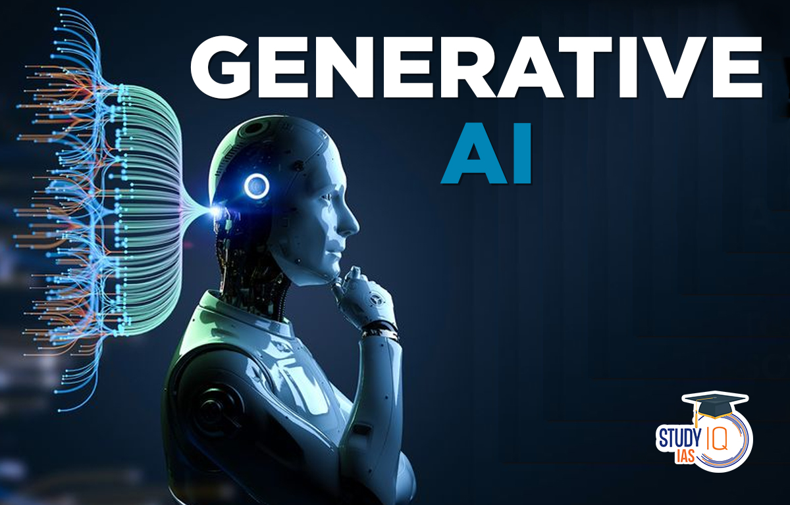

# NOTCH AI: Changing the world, one step at a time.

## Welcome to NotchAI, where innovation meets healthcare. We're dedicated to revolutionizing the medical landscape with cutting-edge AI solutions. Our mission is to provide accessible, accurate, and timely health insights to empower individuals in managing their well-being.

 

### Table of Content

- [Structure](#structure)
- [Purpose](#purpose)
- [How Generative AI are Solving the Problem](#generativeAI)
- [License](#license)

 

------

##  structure

 - Frontend
  - Here, you will find the frontend code for the NOTCHAI application, implemented using Flutter, and Dart. This directory also includes the Android, ios files for the user interface since flutter is used for cross-platform.
 - Backend
  - This directory contains the backend code of the NOTCHAI application, including the API endpoints, database models, and business logic implemented in nodejs, a javascript runtime 

 

## Purpose

The repository serves as a centralized hub on GitHub for the NotchAI project, housing both frontend and backend codebases, documentation, and project management tools. It facilitates collaborative development, version control, and efficient deployment processes for our AI-driven healthcare solution.

 

## How Generative AI are Solving the Problem

Generative AI plays a pivotal role in addressing NotchAI's primary challenge: rapid and accurate diagnosis and patient scanning. By leveraging generative AI algorithms, our solution can swiftly analyze live patient data, such as skin rashes or symptoms, in real-time through image recognition or natural language processing. This technology allows for rapid assessments, identifying potential medical conditions and suggesting treatment options with remarkable speed and precision. It revolutionizes healthcare by providing immediate, reliable insights, ultimately expediting the diagnostic process and improving patient outcomes while reducing the burden on medical professionals and facilities.

 

### All of the source codes are available here.

- NOTCHAI Frontend APP SOURCE CODE [@nnam-droid12](https://github.com/nnam-droid12/notchai-frontend)
- NOTCHAI Backend App SOURCE CODE [@nnam-droid12](https://github.com/nnam-droid12/notchai-backend)